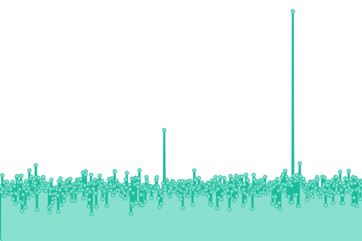
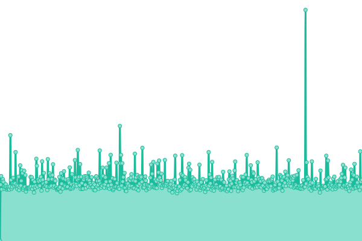
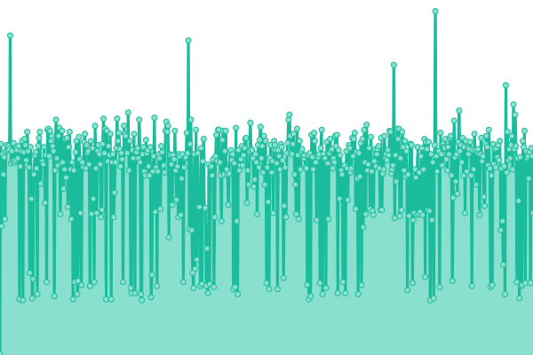

# [📈 Live Status](https://status.papinotasapp.com): <!--live status--> **🟩 All systems operational**

This repository contains the open-source uptime monitor and status page for [Papinotas](https://papinotas.com), powered by [Upptime](https://github.com/upptime/upptime).

With [Upptime](https://upptime.js.org), you can get your own unlimited and free uptime monitor and status page, powered entirely by a GitHub repository. We use [Issues](https://github.com/Papinotas-Desarrollo/upptime/issues) as incident reports, [Actions](https://github.com/Papinotas-Desarrollo/upptime/actions) as uptime monitors, and [Pages](https://status.papinotasapp.com) for the status page.

<!--start: status pages-->
<!-- This summary is generated by Upptime (https://github.com/upptime/upptime) -->
<!-- Do not edit this manually, your changes will be overwritten -->
<!-- prettier-ignore -->
| URL | Status | History | Response Time | Uptime |
| --- | ------ | ------- | ------------- | ------ |
|  [Papinotas app](https://papinotasapp.com/user) | 🟩 Up | [papinotas-app.yml](https://github.com/Papinotas-Desarrollo/upptime/commits/HEAD/history/papinotas-app.yml) | 

 264ms
     
 | 

<a href="https://status.papinotasapp.com/history/papinotas-app">100.00%</a>
    

|  [Papinotas Homepage](https://www.papinotas.cl) | 🟩 Up | [papinotas-homepage.yml](https://github.com/Papinotas-Desarrollo/upptime/commits/HEAD/history/papinotas-homepage.yml) | 

 2459ms
     
 | 

<a href="https://status.papinotasapp.com/history/papinotas-homepage">100.00%</a>
    

|  Microservicio Firma Digital | 🟩 Up | [microservicio-firma-digital.yml](https://github.com/Papinotas-Desarrollo/upptime/commits/HEAD/history/microservicio-firma-digital.yml) | 

 184ms
     
 | 

<a href="https://status.papinotasapp.com/history/microservicio-firma-digital">100.00%</a>
    

<!--end: status pages-->

[**Visit our status website →**](https://status.papinotasapp.com)

## 📄 License

- Powered by: [Upptime](https://github.com/upptime/upptime)
- Code: [MIT](./LICENSE) © [Papinotas](https://papinotas.com)
- Data in the `./history` directory: [Open Database License](https://opendatacommons.org/licenses/odbl/1-0/)
